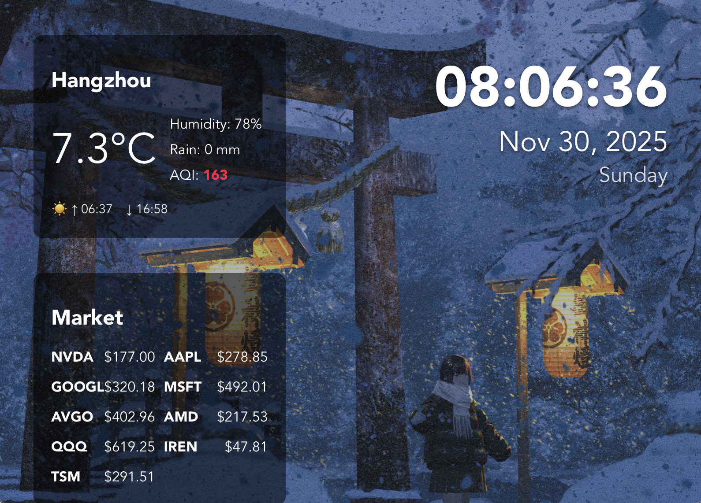

#  PhotoPulse



**Breathe new life into your idle devices.** 

PhotoPulse is a lightweight, cross-platform application designed to transform your unused laptops, tablets (like Microsoft Surface), or secondary monitors into a premium **Smart Digital Photo Frame**. It seamlessly blends your personal photo collection with a real-time information dashboard including weather forecasts, tracked stock prices, and crypto market trends.

---

## ✨ Features

- **Cinematic Carousel**: Automatically cycles through images in your backgrounds folder with smooth crossfade transitions.
- **Market Pulse**: Real-time stock prices (NVDA, AAPL, MSFT...) fetched from Yahoo Finance.
- **Weather Integration**: Local weather updates based on your configuration.

## 🚀 How to Use

###  macOS
1.  **Download**: Get the latest `.dmg` or `.app` from the [Releases](#).
2.  **Install**: Drag `PhotoPulse` to your `Applications` folder.
3.  **Permissions**: On the first launch, **right-click** the app and select **Open** to bypass macOS Gatekeeper.
4.  **Setup**: Press **`** (backtick) to open the Debug Panel, click **"Open Backgrounds"** to add your photos, and **"Open Config Folder"** to edit your settings.

### 🪟 Windows
1.  **Download**: Get the `.msi` or `.exe` installer.
2.  **Install**: Run the installer and follow the prompts.
3.  **Setup**: Launch the app and use the **`** shortcut to access folders via the Debug Panel. Configuration and background images are stored in your user's `AppData/Roaming/com.bingliang.photopulse` folder.

### 🐧 Ubuntu (Kiosk Mode)
1.  **Install App**: Download the `.deb` package and install it:
    ```bash
    sudo dpkg -i photopulse_0.1.0_amd64.deb
    # If there are missing dependencies, run:
    sudo apt --fix-broken install -y
    ```
2.  **Auto-start**: To launch automatically on login, create `~/.config/autostart/photopulse.desktop`:
    ```ini
    [Desktop Entry]
    Type=Application
    Name=PhotoPulse
    Exec=tauri-app
    X-GNOME-Autostart-enabled=true
    ```

---

## ⌨️ Usage & Shortcuts

- **`** (Backtick): Toggle the **Debug Panel / Console**.
- **Arrow Right / Left**: Manually switch to the **next / previous** image.
- **Debug Panel**:
  - **Open Backgrounds**: Opens the folder for your photos.
  - **Open Config Folder**: Opens the folder containing `config.json`.

---

## ⚙️ Configuration (`config.json`)

Customize your experience by editing the `config.json` file in your system's AppData directory.

```json
{
  "stocks": ["NVDA", "AAPL", "MSFT"],
  "crypto": ["BTC-USD", "ETH-USD"],
  "interval": 30,
  "weather": {
    "city": "Hangzhou",
    "latitude": 30.27,
    "longitude": 120.15
  }
}
```

- **stocks / crypto**: Arrays of Yahoo Finance ticker symbols.
- **interval**: Seconds between automatic image changes (default: 30).
- **weather**: City name and coordinates for local updates.
